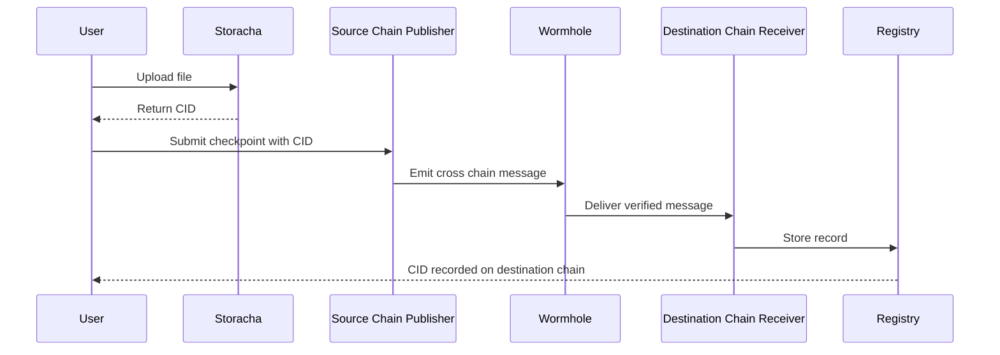

# Storacha Multichain Checkpointer

Storacha Multichain Checkpointer lets you store a file on Storacha and record its proof across multiple blockchains using Wormhole.

It creates a verifiable on chain record of a Storacha CID on a source chain and propagates it to one or more destination chains.

## Current Deployment

Live cross chain flow:

Base Sepolia → Avalanche Fuji

The architecture supports additional Wormhole connected chains as targets.

---

## What It Does

- Upload a file to Storacha
- Generate a CID
- Create a checkpoint on a source chain
- Send the checkpoint through Wormhole
- Confirm and store it on a destination chain

---

## Sequence Diagram

---

## Use Cases

### Cross Chain Proof of Storage

Anchor a Storacha CID on one chain and confirm it on another, creating a verifiable record across networks.

### Data Provenance Tracking

Record who created a piece of data and when, and propagate that record across chains.

### AI Dataset Attestation

Publish and verify dataset references used in AI workflows.

### Cross Chain Content Verification

Allow applications on different chains to verify the same CID independently.

### Redundant Record Anchoring

Reduce reliance on a single blockchain by recording proofs on multiple chains.

### Agent Driven Data Publishing

Enable automated agents to create and propagate verifiable data records using SDK tooling.

---

## Architecture

Storacha CID
→ Source chain publisher
→ Wormhole
→ Destination chain receiver
→ On chain registry

---

## Project Status

### Completed

- [x] Upload files to Storacha
- [x] Verify CID availability across IPFS gateways
- [x] Create blockchain checkpoints with metadata
- [x] Cross chain messaging via Wormhole
- [x] Multi wallet support with MetaMask and WalletConnect
- [x] Publisher contract live on Base Sepolia
- [x] Receiver contract live on Avalanche Fuji
- [x] End to end Base Sepolia → Avalanche Fuji flow validated
- [x] Replay protection enabled on receiver

---

### In Progress

- [ ] Structured data attestation format
- [ ] On chain provenance registry
- [ ] TypeScript SDK for attestation creation
- [ ] ElizaOS adapter integration
- [ ] Expanded documentation in docs/

---

### Ahead

- [ ] Support additional Wormhole connected chains
- [ ] Improved indexing and querying
- [ ] Propagation time benchmarking
- [ ] Developer integration examples

---

## Documentation

All project documentation is located in the `docs/` directory.

| Document     | Path                                           | Description                         |
| ------------ | ---------------------------------------------- | ----------------------------------- |
| Architecture | [docs/architecture.md](./docs/architecture.md) | Cross chain system overview         |
| Contracts    | [docs/contracts.md](./docs/contracts.md)       | Contract roles and responsibilities |
| Deployment   | [docs/deployment.md](./docs/deployment.md)     | set up and Testnet deployment guide |
| Roadmap      | [docs/roadmap.md](./docs/roadmap.md)           | Project phases and milestones       |
| Product      | [docs/product.md](./docs/product.md)           | Product vision and positioning      |
| Extras       | [docs/extras.md](./docs/extras.md)             | Diagrams, demos, benchmarks         |

---

## License

MIT
