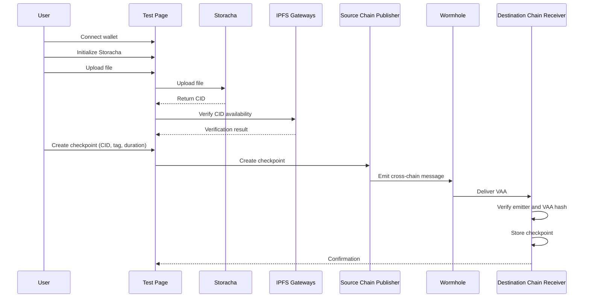

# Architecture

Storacha Multichain Checkpointer allows a user to upload a file to Storacha, verify its CID across IPFS gateways, and create a cross-chain checkpoint using Wormhole.

The system records a verifiable on-chain checkpoint on a source chain and confirms it on a destination chain.

---

## Current Live Architecture

### Components

**Storacha**
Stores file content and returns a CID.

**Frontend (Test Page)**
Responsible for:

- Wallet connection (Injected, MetaMask, WalletConnect)
- Storacha initialization
- File upload
- CID verification via IPFS gateways
- Submitting checkpoint transactions
- Displaying test results and status indicators

**Publisher Contract (Source Chain)**

- Accepts CID and metadata
- Emits a Wormhole cross-chain message

**Wormhole**

- Relays cross-chain messages
- Delivers verified VAAs to the destination chain

**Receiver Contract (Destination Chain)**

- Verifies the Wormhole message
- Validates the configured source contract (emitter)
- Enforces replay protection using stored VAA hashes
- Stores the checkpoint on chain

There is no separate registry contract in the current deployment. The receiver stores checkpoint data directly.

---

## Current Flow

1. User connects a wallet in the frontend.
2. User initializes Storacha.
3. User uploads a file to Storacha.
4. Storacha returns a CID.
5. The frontend verifies the CID across IPFS gateways.
6. User submits a checkpoint transaction on the source chain.
7. The publisher emits a Wormhole message.
8. Wormhole relays the message to the destination chain.
9. The receiver verifies the VAA, checks the emitter, prevents replay using the VAA hash, and stores the checkpoint.

---

## Sequence Diagram

---

## Multi-Chain Design

The system is chain-agnostic.

Any supported source chain can publish a checkpoint.
Any supported destination chain can receive and store it.

To support additional chains:

- Deploy a publisher on the new source chain
- Deploy a receiver on the new destination chain
- Configure the trusted source contract
- Update frontend configuration

The Wormhole transport layer remains unchanged.

---

## Security and Correctness

- The receiver only accepts cross-chain messages from the configured source contract.
- Each Wormhole message is uniquely identified by its VAA hash.
- Processed VAA hashes are stored on chain to prevent replay.
- Frontend environment variables prefixed with `NEXT_PUBLIC_` are public and must not contain secrets.
- Deployment private keys are used only for Hardhat deployment and are never exposed to the frontend.

---

## Planned Extension: Phase 1 Data Attestation

This section describes upcoming work and is not part of the current live deployment.

Phase 1 introduces:

- A structured attestation payload format
- Extended receiver decoding logic
- A separate on-chain registry for indexed provenance
- A TypeScript SDK for building and validating attestations
- An adapter for agent-driven workflows

The cross-chain transport path remains:

Source chain publisher → Wormhole → Destination chain receiver

The extension builds on top of the existing verified transport layer..
